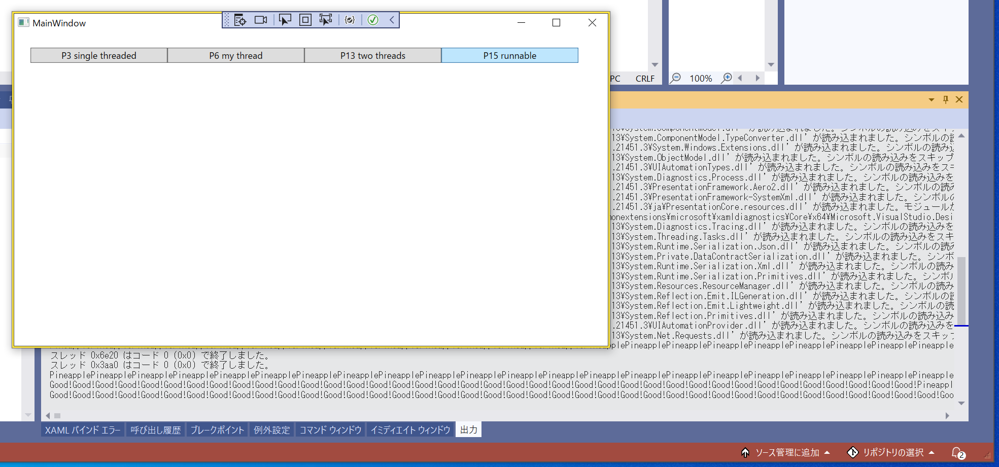

# wpf-multithread-practice

WPFでマルチスレッドの練習  

  

📖 [増補改訂版 Java言語で学ぶデザインパターン入門 マルチスレッド編 Kindle Edition](https://www.amazon.co.jp/exec/obidos/ASIN/4797331623/aaaaab0c-22/ref=nosim/)  
👆 このKindle本読んで勉強  
📖 [マネージド スレッド処理](https://docs.microsoft.com/ja-jp/dotnet/standard/threading/)  
👆 C# .NET のスレッド処理はこのページが公式  
